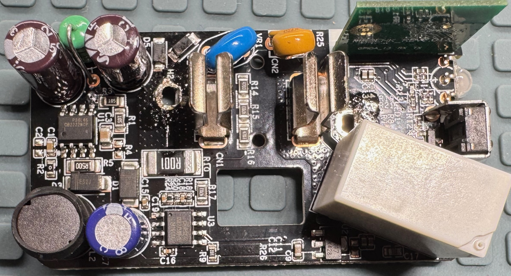
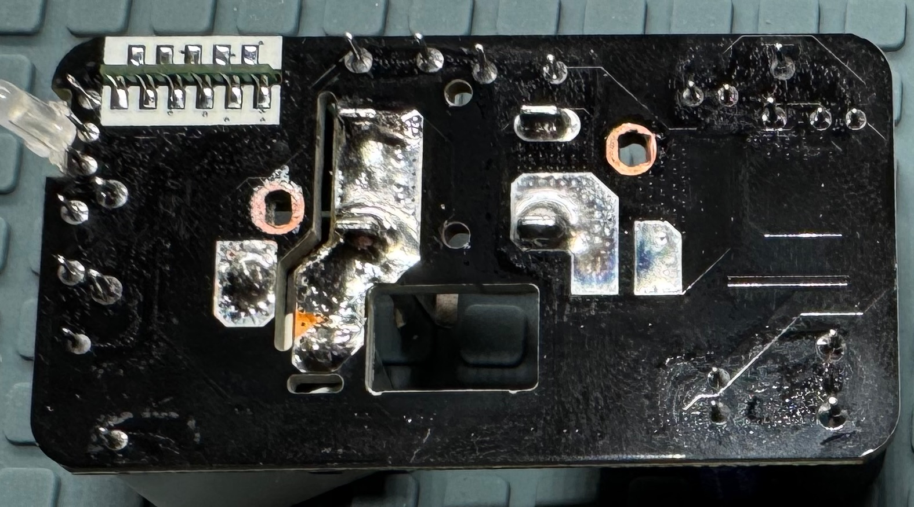
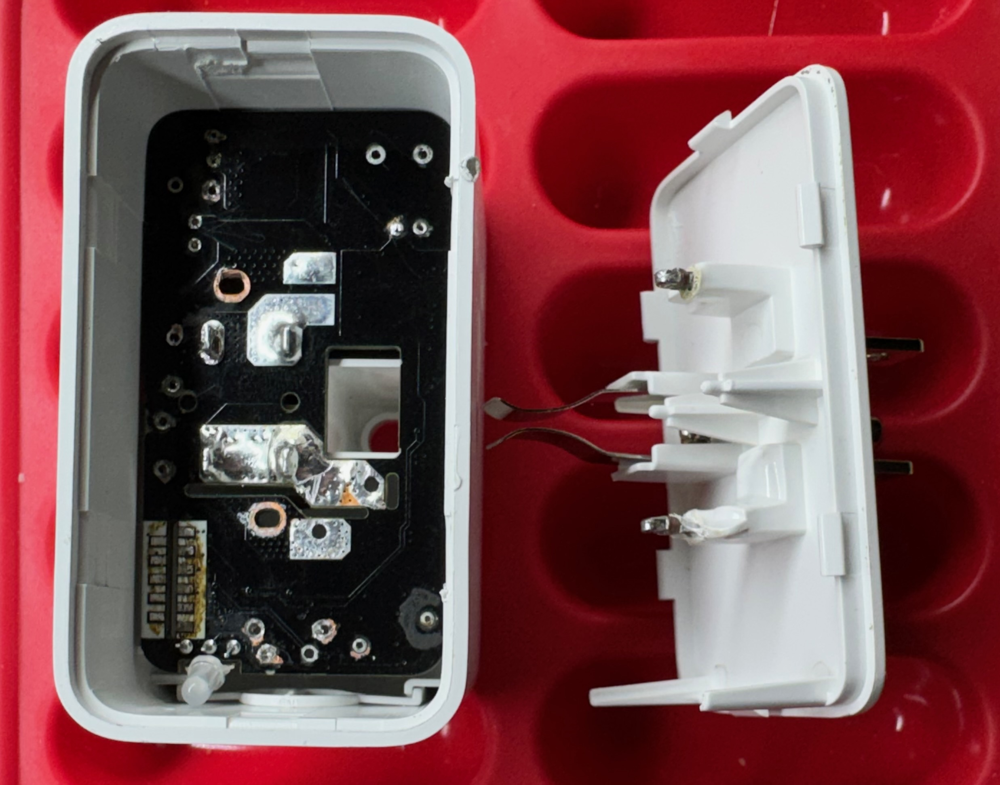

# Smart switched outlet (2025) teardown

## History and product overview

A smart switched outlet is actually a device that plugs into a non-switched
outlet and has its own power outlet on it. The device is controllable remotely
over Wi-Fi and allows the device to be turned on and off.

This smart switched outlet is sold by Meross.
Meross describes it as a Matter smart plug.
It uses Matter over IPv6 over WiFi. It does not use Thread.
This is for US voltage and outlets. It was purchased in July 2025.
The device allows switching of the outlet and remote monitoring of
the switch state. It also allows continuous monitoring of the power
and energy usage by the attached switched device.

## Electrical background

In the US most appliances use 3-prong plugs with two parallel blade conductors
for the power conduction and a round pin for the protective ground.
The standard outlet for 120V at up to 15A (60Hz) is a NEMA 5-15R.
The plug that goes into it is a NEMA 5-15P.
The power is provided with one blade conductor that is at 120VAC RMS potential
compared to ground (called live, line or hot) and one blade conductor that
is at zero potential compared to ground (called neutral or return).

Protective ground should never be interrupted so that the device is grounded even
when off.
To turn a device off it is only necessary to interrupt the power circuit at any
point. This will cease current flow.
However it is safer to do this by interrupting the live conductor. This means all
circuitry in attached appliance will be at 0V potential as both conductors
still connected are at 0V potential.
To ensure the live is switched requires a polarized plug. In the US this is
done on ungrounded plugs with two different sized blades, one too large to fit
in the live slot. Grounded plugs with the round pin are inherently oriented
and do not require two different-sized blades.

## How it works

This device directly connects ground from the device socket to the wall plug
at all times. It also connects neutral continuously but places a current
sensing resistor in the path of the neutral connection.
It accomplishes its switching by interrupting the live line using a relay.

The relay is controlled using a single bit from a controller board that drives
a GPO line high or low. The main board also has an LED to indicate status
which is controlled by two GPO lines. It has a power and energy monitoring
chip which is read out by the controller board over a 4800bps 5V logic-level
RS-232 serial line.

## Circuit analysis

[view schematic as a PDF here.](smart-outlet-m-reverse.pdf)

The device contains a transformerless switching power supply to generate a
neutral-referenced 5V supply used to actuate the relay.
It has a 3.3V low dropout linear regulator to further reduce this for
use by the measurement chip and the microcontroller.
It contains a controller sub-module which has a Realtek Bluetooth radio
and microcontroller (RTL8720CM) which utilizes the 3.3V supply.
It measures current as a voltage differential across a 1mΩ sense resistor in
the neutral path from the device to the wall supply to measure instantaneous
current draw of the attached device.
It has a resistor chain from the live side into a voltage divider which is
then measured to determine the line voltage so power can be calculated.
It uses a 277V/16A-rated relay on the live side to turn the connected device
on and off.

The board has a bit over 1mm of creepage between RECT_AC and NEUTRAL_SRC.
It has the same clearance between the unswitched live and switched live.
For these conductors it is improved by using a 1mm slot.
The protective ground pin is not connected to anything inside except the
output receptacle.
The controller uses a GPO to turn the relay on and off through an NPN transistor.
It uses two GPOs to directly turn the LED red, green or off.
The controller uses a negative temperature coefficient thermistor to measure
the internal temperature of the device through an analog input,
presumably for protection.
The controller reads power draw parameters from a measurement chip over a
serial link.
The power input is fused for the controlling circuitry with a self-resetting
polyfuse and uses a metal-oxide varistor to withstand surges.
Power through the unit to the attached device is not protected with a fuse
or similar.

### Main schematic page

The function button (SW1) is read on a GPI to the controller board.
The button has an external pull up resistor (R23) so the GPI reads
high when the button is not pressed and low while it is pressed.

NTC1 is a temperature-sensitive resistor. It is read by being placed in a
resistive divider with R8. The node between them will change in voltage as
NTC1’s value changes. This voltage is read as an analog value through R7.
R7 will limit the current into the controller. As the analog input is
high impedance R7 does not form another voltage divider and so does not alter
the voltage read to a significant amount. The NTC1 cannot fully be
identified but likely has a B25/50 value of 4250K as this is the type
commonly used to measure human-scale ambient temperatures.

LED1 is referenced to 3.3V and so the emitters are turned on by driving
LED_RED or LED_GREEN low.

C13 and C14 are smoothing capacitors to smooth the voltage provided to the
controller circuitry.

### Power control page

Several functions are provided on this page. The simplest is to connect input
ground directly to the ground on the power outlet side.

The second is to
connect input neutral to the neutral on the power outlet side. Neutral
passes through a 1mΩ resistor, R10. This allows current
to be measured by measuring the voltage drop (differential voltage) across
R10. Differential voltage is measured using Kelvin (4-wire) sensing through
the nets NEUTRAL_SRC_SENSE and NEUTRAL_LOAD_SENSE. The voltage is measured
on the inside edge of each end endcap of the resistor using a parallel
path to the current path and the difference between the two will be 1mV
for each 1A of current drawn by the switched device.

The third function is to supply AC power to the power supply circuit so it
can create 5V DC power from the AC power. The line voltage is divided by a
resistive divider comprising R25 and VR1. Despite the differing reference
designators both R25 and VR1 are variable resistance devices. R25 is a PTC
(positive temperature coefficient) polyfuse. VR1 is an NTC (negative
temperature coefficient) metal oxide varistor (MOV). When
connected to the wall
R25 will have a low resistance (20Ω or so) and NTC1 will have a very high
resistance. So FUSED_AC will be the same as the line voltage. R25 will limit
inrush current. If the control circuity draws too much current on FUSED_AC
the current through R25 will cause R25 to increase its resistance greatly
("blow"). The polyfuse will reset after a period of time and things
will start again. This will
repeat until the fault is cleared or the polyfuse fails completely and
the unit ceases to operate. If there is a high voltage surge from the wall
source then VR1 will begin to conduct (around 775V) and this will change
the voltage divider so FUSED_AC is reduced in voltage. It also will
increase current draw through R25 and so likely will trigger the polyfuse
also.

The final function is to switch the output live power on and off
using a relay. Relay K1 connects the output live to the wall source when
energized. K1 is energized by the controller applying a positive
logic-level voltage on POWER_EN. Once the base (pin 1) of Q1 is 0.6V
or more positive than the emitter (pin 2) then current flows into
the collector (pin 3) and out the emitter. This happens when POWER_EN
is driven high by the controller. This induces a current through R22
and the base. The current will be at least 3mA. This will cause Q1 to
attempt to drive at least 117mA through the collector through the coil
of K1. This is more
than enough to energize K1 fully. D4 serves to snub the voltage the
inductor (coil) in K1 produces momentarily when Q1 is switched off.
C17 serves to reduce the draw on +5V when the coil is first switched
on by producing a low ESR charge store.

### Power supplies page

The top half of this is a sophisticated neutral-referenced transformerless
switch-mode power supply (SMPS). The sophistication is mostly contained
within U1 and will not be fully explained here.

The short version is that U1 takes unregulated energy in and outputs
a reduced regulated voltage. It is capable of converting excess
voltage into increased current similar to how a transformer does
and the power (Watts) in is similar to the power out, just the
available voltage at the output is lower than the input and the
available current is increased inversely. It does this by rapidly
switching its output on and off to send energy into an inductor.
This inductor stores the energy in its magnetic field. It is drawn
off by the devices being supplied. It adjusts its switching duty
cycle so as to send the right amount of energy into the inductor
to match the energy being drawn out of the inductor and thus
keep the inductor voltage relatively constant. The inductor’s
resistance to current change and its ability to store energy in
its magnetic field are critical in making this happen.

Fused AC power at about 120V RMS comes in on FUSED_AC. D2 performs a positive
half-wave rectification on the AC. D5 applies a redundant half-wave
rectification. D5 is present only because diodes have some tendency to
become short circuits when failing. This would put AC voltage into the
circuit and produce a small conflagration within the device. By having two
diodes both D2 and D5 have to fail short to produce this result. This
should reduce the incidence of these small fires to the square of the
incidence rate with a single diode. So if this failure rate would be
one in one thousand over the life of the product then with two
consecutive diodes the failure rate would drop to one in a million
instead.

U1 and L2 work in tandem to drive the right-hand side of L2 to the
regulated voltage. This puts 5V across C7. R9 provides a minimum
current draw at the output to make the result of regulation through
switching more accurate.
U1 is rated for up to 300mA output current.

The bottom half of this page is a low-dropout linear regulator. A
linear regulator works by "burning off" any excess voltage at
the input so that the output voltage is regulated to the desired
value. This is usually done internally with a load resistor,
a current shunt and an op-amp.
U3 provides this regulation functionality on its own
and is fixed at 3.3V target output voltage. C10 and C11 provide
output smoothing. C9 provides input smoothing and
increases ripple rejection.

### Current measurement page

U3 is a complete current, voltage and power measurement solution.
It provides instantaneous voltage, current and power measurements
over a 4800bps 5V logic-level RS-232 serial link repeatedly every
54.912ms. These measurements can be accumulated over time to
calculate total energy used. The resistive divider created by
R12 and R13 reduce the serial output signal to 3.3V as the
controller uses 3.3V I/O. C15 provides supply voltage smoothing to
U3.

U3 measures the input voltage on pin 4 (V2P). Pin 4 cannot be
outside the range ±2V relative to GND. To overcome this the
resistive divider created by R14, R15, R16, R17 and R18 reduces
the input voltage to 0.0532% of the input voltage. This puts the
voltage in the range of ±100mV. Using multiple resistors is common
because of the high value needed and the high voltage at the
top of the divider. With 4 resistors on top of the ladder
each only drops up to 40V and so operates within the voltage
rating of an 0805 resistor instead of having to use a
more expensive large
format resistor. C16 smoothes the voltage and also
resists droop of the voltage when the sample and hold capacitor
on pin 4 captures the signal.

U3 measures the input current on pins 2 and 3 (V1P, V1N).
NEUTRAL_LOAD_SENSE and NEUTRAL_SRC_SENSE are connected to the
current sense resistor using the inner edges of the pads so
as to create a parallel path for voltage sensing (4-wire sensing).
R20, R24, C18 and C19 create low pass filters to reduce
unrepresentative readings for loads with spiky current draws.
Pins 2 and 3 are both on the neutral line which is no more than
1mΩ from GND and so should not
produce voltages which differ more than ±100mV from GND.

## Meta-analysis

Any criticisms here are constructive and do not necessarily indicate a serious
flaw in the product.

The power supply chip employed suggests using a full-bridge rectifier for its AC input.
However this design uses half-wave. It does however put two diodes in series so that
a single diode failing short does not produce a short. This is probably a reasonable
design choice.

The power supply chip regulates voltage referenced to system ground but is not
connected to system ground. Regulation is surely still acceptable but likely
less precise than could be achieved with a direct connection to the ground
reference.

The device contains no X-class capacitor at all. One is suggested for the power
supply chip but it is omitted. With no non-resetting fuse inside this may be the
right choice. It does seem to go against the company claims of "protection against
short-circuits" somewhat. Even if this has some software in the controller to
turn off on a measured overcurrent or over-temperature this device is relying on
wall circuit protection for true overcurrent protection.

While the device has internal temperature monitoring of a sort due to NTC1
it has no failsafe method of using that to prevent overheat. If the failure
which produces the overheat is not in the controller itself then the controller
will presumably use the temperature readings to shut down the attached device.
If the control circuity itself fails it will hopefully be shut down by the polyfuse
due to overcurrent.

The wireless interface chip is rated by the manufacturer at 500mA max current
draw. It is powered by a 3.3V LDO which is in a package too small to be rated
at 500mA. It surely is rated at 300mA or less. Despite this the LDO has 20µF of
capacitance on the outputvside. This normally would be for a 2A regulator.
In this case it seems that these capacitors are sized to try to make enough
instantaneous current available to overcome
the underrating of the LDO for short periods of high draw.
This seems to work fine but no measurements were made.

Measurements in U3 may be scaled up or down by choices of different
current sense resistors and voltage dividers. This must be
compensated for in software on the controller or on device software
that receives the readings over the network as U3 does not receive
commands and so cannot be instructed to rescale its calculations.

The small slit around the single button is not gasketed unlike another smart switched
outlet I purchased. This would mean liquids could ingress. It is nearest a low voltage
portion of the board and of course the button. The device also has the
receptacle on the front and those are not sealed so water could ingress there also
as it could on any similar device.

There are small quirks about the board layout. Unnecessary vias, etc. It uses a lot
of small floods in places. None of these issues are of importance.

### teardown images

### Device identification

The device is approximately 70mm wide by 40mm high by 40mm deep.
It has a NEMA 5-15P on the back to plug into a US outlet. It has
a NEMA 5-15R on the front for plugging in the device you wish to switch.
It is rated for 15 amps in and out and "120V" (presumably RMS nominal).

On the back it is identified as:

Smart WiFi Plug Mini

Model: MSS315

It lists as containing FCC ID 2AMUU-MWA05 and IC 24963-MWA06

## Design tools

This is a KiCAD 9.X project. KiCAD is a free electronic design tool
[available at kicad.org](https://kicad.org/).
